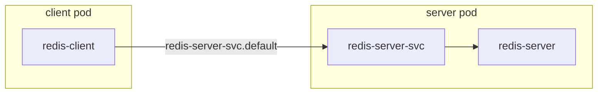

# K8s DNS and service discovery

One of the best features of `docker-compose` is that containers will be able to reach each other simply using the service name defined in the `docker-compose.yml` (attention: in compose a service is a container deployment specification, whereas in k8s it's something very different!).

In k8s things are slightly more because there is a clear distinction between deployments (the actual processes) and services (the network "instructions" on how to reach the deployments). This decoupling is very smart for proper production deployments, but it can feel somewhat obnoxious coming from the simple world of docker-compose.

Nevertheless, the same functionality can easily be achieved in k8s (in tens of ways). In this directory I provide an example of how to do it following best practices.

### Example

* `redis-client.deployment.yaml`: redis client deployment
* `redis-server.deployment.yaml`: redis server deployment
* `redis-server.service.yaml`: redis-server-svc service




### Instructions

1. install k3d, skaffold
    ```bash
    $ brew install k3d skaffold
    ```

2. create a disposable kubernetes cluster. k3d will also setup coredns for us.
    ```bash
    $ k3d cluster create learning-dns-service-discovery
    ```

3. deploy the example
    ```bash
    $ skaffold run
    ```

4. get a shell on the client
    ```bash
    $ kubectl exec -ti $(kubectl get pods | grep -o "redis-client-\w*-\w*" | head -1) -- bash
    # you will get a shell inside the container, your container name will be slightly different
    $ root@redis-client-58bf8d4994-2vqvg:/data# 
    ```

5. You can reach the redis server at the hostname `service.namespace`, in this case `redis-server-svc.default`. Namespace will be always `default` unless otherwise specified. The service space is specified in the service manifest (`redis-server.service.yaml`). You can see the services with `kubectl get svc | grep redis-server`
    ```bash
    $ root@redis-client-58bf8d4994-2vqvg:/data# redis-cli -h redis-server-svc
    $ redis-server-svc:6379> ping
    PONG
    ```

6. When you are done, destroy the cluster and its resources with
    ```bash
    $ k3d cluster delete learning-dns-service-discovery
    ```

### Best practices & resources

although there are alternative methods, using services to reach deployments is the recommended way to enable inter-pod communication. Likewise using a cluster wide dns resolver (like the one that comes by default with k3d) is the recommended way to enable service discovery. Notice that I did not create a service for the redis-client deployment, but only for the server.

* https://kubernetes.io/docs/concepts/services-networking/service/
* https://kubernetes.io/docs/tasks/debug-application-cluster/get-shell-running-container/
* https://kubernetes.io/docs/concepts/services-networking/connect-applications-service/